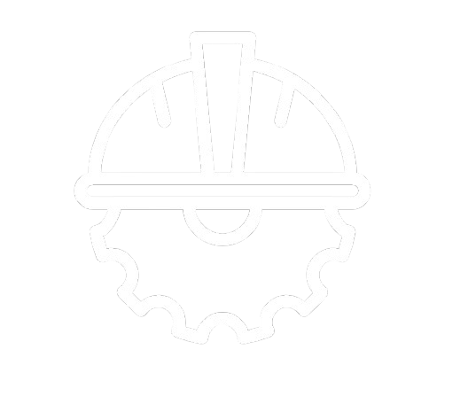

# Construct() - AI-Powered Infrastructure Health Monitoring




## Overview

This project, developed by **Team PrimAI**, implements an AI-based system to monitor the health of critical infrastructure such as roads, bridges, and buildings. By analyzing images, the AI model predicts the current condition, estimates the remaining lifespan, and provides actionable insights for maintenance. The goal is to enhance safety, optimize maintenance schedules, and prevent accidents.

## Features

- **Highly Accurate AI Model**: Provides precise condition assessments and predictions.
- **Automated Image Analysis**: Uses AI to assess the condition of infrastructure from images.
- **Predictive Maintenance**: Forecasts maintenance needs and lifespan of roads, bridges, and buildings.
- **Real-time Monitoring**: Provides continuous updates on infrastructure health.
- **Web-based Interface**: User-friendly dashboard for visualizing AI-generated reports.
- **Actionable Insights**: Recommends maintenance schedules and alerts for critical conditions.
- **Modern UI & User-Friendly Design**: Ensures a seamless experience for users.

## Tech Stack

- **Frontend**: React.js / Next.js (or your preferred framework)
- **Backend**: FastAPI / Node.js / Django
- **AI/ML Model**: TensorFlow / PyTorch
- **Database**: PostgreSQL / MongoDB
- **Cloud & Deployment**: AWS / Google Cloud / Azure / Docker

## Installation & Setup

1. **Clone the repository:**
   ```bash
   git clone https://github.com/your-repo/infrastructure-ai.git
   cd infrastructure-ai
   ```
2. **Install dependencies:**
   ```bash
   pip install -r requirements.txt  # For backend (Python-based)
   npm install  # For frontend (if using React/Next.js)
   ```
3. **Run the backend:**
   ```bash
   python app.py  # or your backend start command
   ```
4. **Run the frontend:**
   ```bash
   npm run dev
   ```
5. **Access the web app at:** `http://localhost:3000`

## Usage

1. Upload an image of infrastructure (road, bridge, or building).
2. The AI model analyzes the image and provides:
   - Condition assessment
   - Estimated lifespan
   - Recommended maintenance actions
3. View results on the dashboard and download reports.

## Project Members (Team PrimAI)

| Name               | Email                                                          |
| ------------------ | -------------------------------------------------------------- |
| Rohan Garg         | [garg20005rohan@gmail.com](mailto\:garg20005rohan@gmail.com)       |
| Aditya Chandak     | [aditya.chandak234@gmail.com](mailto\:aditya.chandak234@gmail.com) |
| Ishaan Bansal      | [ishaanbansal1412@gmail.com](mailto\:ishaanbansal1412@gmail.com) |
| Merin Theres Jose  | [merintheresjose@gmail.com](mailto\:merintheresjose@gmail.com) |
| Parteek Babal      | [parteekbabal14@gmail.com](mailto\:parteekbabal14@gmail.com) |

<!-- ## Contributing

Contributions are welcome! Feel free to open issues or submit pull requests. -->

<!-- ## License

This project is licensed under the MIT License. -->

---

*Developed with passion by Team PrimAI to improve infrastructure safety and efficiency.* 🚀

